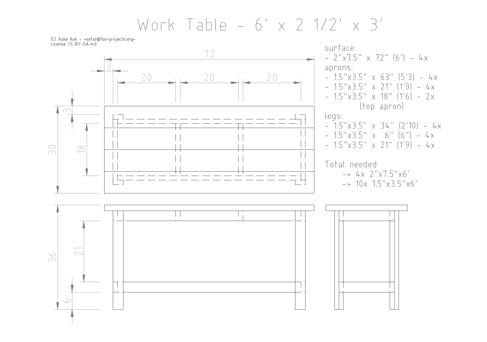

# Simple Worktable Design

## Description

I made this worktable design from scratch to try and create a very
simple and easy to understand build plan. It uses simple 2x4's and a
slightly thicker top surface (but you could easily replace that). The
legs are double thickness and the apron is doubled to create a simple
but very robust load bearing frame.

All the measurements are as simple as possible - straight whole inch
cuts as much as possible. The pattern needs glue and screws for some
of the butt joints, but you could use your favorite joints wherever
appropriate. I used a total of 32 screws (3" #10) myself. All wood-wood
contact spots in the frame should be glued. Especially the 4 legs. The
surface should be attached using something like the figure 8 table
surface fasteners.

I mill my own wood, so it's not rounded. If you want to avoid rounded
edges, you will have to buy larger lumber and trim it down to size.

## Construction

After cutting all the pieces to size, I constructed the apron and the
shelf boxes first. Then I set those aside and assembled the 4 legs
by glueing the 3 pieces of the legs together. I used clamps to hold
them side by side while glueing to make sure they were all exactly
the same size and the "slot" at the same offset. I used 2 4x2 x 2'
pieces as fitting to make sure everything was parallel and properly
spaced for receiving the shelf and apron. After the legs were glued,
I then lay flat 2 of the legs and glued+screwed the apron and shelf
upright. Then I glued on the other 2 legs on top of the apron and
shelf. This way I could make sure the shelf and apron and legs were
all perpendicular, which should be easier than trying to fix all legs
to the apron or shelf first.

## License

This design is CC-BY-SA-4.0 - (C) Auke Kok <sofar@foo-projects.org>

Share with attribution, share-alike licensed. If you distribute the
design (modified or not), you have to maintain attribution. You must
also share the work under the same license.

## Preview

